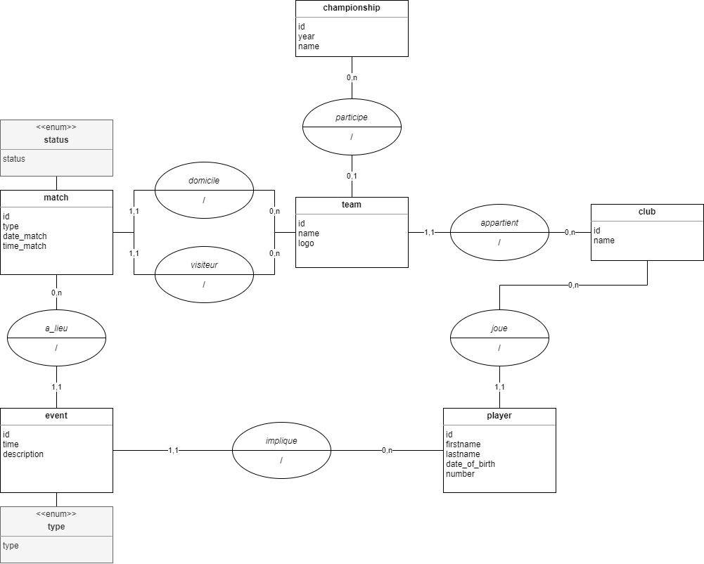

# Quidditch Project - IUTM

> Participants :
> - [Kevin JUNCK](https://github.com/novachrono67)
> - [Loïc STEINMETZ](https://github.com/B4va)

Le projet consiste en une API permettant de gérer les résultats des différents championnats de quidditch de l'école de
Poudelard. Il propose également un client web pour pouvoir accéder et gérer ces informations.

## Exécution

```
$ docker-compose up --build -d
```

- L'API est accessible à partir de l'url : `localhost:8000/api`
- Le site web client est accessible à partir de l'url : `localhost:3000/`
- La base de données Postgres est accessible via les données de connexion suivantes :
    - URL : localhost:6000
    - Utilisateur : user
    - Mot de passe : pass
    - Base de données : db

## Conception

### Architecture générale

Le projet fonctionne sur la base de trois conteneurs **Docker** :

- Une base de données **PostgresSQL**
- Une application serveur, développée en **C#** suivant l'architecture **REST**.
- Une application client, développée en **JavaScript** via **Node**.


### Base de données

La base de données est configurée et alimentée via le script `database/init.sql`.

**Schéma Entités-Associations :**



**Schéma Relationnel**

° = clé primaire
\# = clé étrangère

```
championship(°id, year, name)
club(°id, name)
team(°id, name, logo, #championship_id, #club_id)
match(°id, status, #home_team, #visitor_team, date_match, time_match)
player(°id, firstname, lastname, date_of_birth, number, #club_id)
event(°id, time, description, type, #match_id, #player_id)
```

### Cas d'utilisation


## Endpoints API

### Liste globale

```
GET /championships
GET /championships/last
GET /championship/:id
GET /championship/:id/matches
GET teams/:id
GET /clubs
GET /clubs/:id
GET /matches/:id
PATCH /matches/:id
POST /matches/:id/event
DELETE /events/:id
```

### Championnats

```
GET /championships

params url : aucun

résultat : informations sur tous les championnats

[
    {
        "id": 1,
        "year": 2000,
        "name": "Championnat de Poudelard 2000"
    },
    ...
]
```

```
GET /championship/:id

params url :
    - id : identifiant du championnat

résultat : informations détaillées d'un championnat

{
   "id": 1,
   "year": 2000,
   "name": "Championnat de Poudelard 2000"
   "teams": [
       {
           "id": 1,
           "name": Gryffondor 2000,
           "logo": null,
           "points": 8
       },
       ...
   ]
}
```

```
GET /championship/last

params url : aucun

résultat : informations détaillées du dernier championnat

{
   "id": 1,
   "year": 2000,
   "name": "Championnat de Poudelard 2000"
   "teams": [
       {
           "id": 1,
           "name": "Gryffondor 2000",
           "logo": null,
           "points": 8
       },
       ...
   ]
}
```

```
GET /championship/:id/matches

params url :
    - id : identifiant du championnat

résultat : informations sur les matchs d'un championnat

{
   "id": 1,
   "year": 2000,
   "name": "Championnat de Poudelard 2000"
   "matches": [
       {
           "id": 1,
           "type": 1,
           "date": "01-01-2000 18:00",
           "status": 1,
           "goldenSnitch": 0,
           "homeTeam": {
               "id": 1,
               "name": "Gryffondor 2000",
               "score": 18
           },
           "visitorTeam": {
               "id": 1,
               "name": "Serpentard 2000",
               "score": 12
           }
       },
       ...
   ]
}
```

### Equipes

```
GET teams/:id

params url :
    - id : identifiant de l'équipe

résultat : informations détaillées d'une équipe

{
   "id": 1,
   "name": "Gryffondor 2000",
   "logo": null,
   "club": {
       "id": 1,
       "nom": "Gryffondor"
   },
   "matches": [
       {
           "id": 1,
           "status": 1,
           "date": "01-01-2000",
           "time": "16:00"
           "home": true,
           "opponent": {
               "id": 4,
               "name": "Serpentard",
               "logo": data
           },
           "scoreHome": 1,
           "scoreVisitor": 2,
           "goldenSnitch": 1
       },
       ...
   ]
}
```

### Clubs

```
GET /clubs

params url :
    - id : identifiant du club

résultat : informations de l'ensemble des clubs

[
    {
        "id": 1,
        "name": "Griffondor",
        "teams": [
            {
                "id": 1,
                "name": "Griffondor 2000"
            },
            ...
        ]
    },
    ...
]
```

```
GET /clubs/:id

params url : aucun

résultat : informations détaillées d'un club

{
    "id": 1,
    "name": "Griffondor",
    "teams": [
        {
            "id": 1,
            "name": "Griffondor 2000",
            "championship_id": 1
        },
        ...
    ]
}
```

### Matchs

```
GET /matches/:id

params url :
    - id : identifiant du match

résultat : informations détaillées d'un match

{
    "id": 1,
    "status": 1,
    "date": "01-01-2000",
    "time": 16,
    "home": {
       "id": 1,
       "name": "Griffondor",
       "logo": null
    },
    "visitor": {
       "id": 4,
       "name": "Serpentard",
       "logo": null
    },
    "scoreHome": 1,
    "scoreVisitor": 2,
    "goldenSnitch": 1,
    "events": [
        {
            "id": 1,
            "time": 42,
            "description": "Faute de Serpentard",
            "type": 1,
            "player": {
                "name": "Drago Malfoy",
                "number": 10
            }
        },
        ...
    ]
}
```

```
PATCH /matches/:id

params url :
    - id : identifiant du match

résultat : lancement d'un match si pas déjà commencé ; arrêt si match en cours

{
    "id": 1,
    "status": 1
}
```

```
GET /matches/:id/players

params url :
    - id : identifiant du match

résultat : joueurs au cours d'un match, à partir des effectifs des clubs

[
    {
        "id": 1,
        "name": "Harry Potter",
        "number": 8
    },
    {
        "id": 2,
        "name": "Drago Malfoy",
        "number": 10
    },
    {
        "id": 3,
        "name": "Hermionne Granger",
        "number": 3
    }
]

```

```
POST /matches/:id/event

params URL :
    - id : identifiant du match

params POST :

{
    "matchId": 1,
    "description": "Faute de Serpentard",
    "type": 1,
    "playerId": 4
}

résultat : création d'un événement associé à un match

{
    "id": 1,
    "time": 42,
    "description": "Faute de Serpentard",
    "type": 1,
    "player": {
        "name": "Drago Malfoy",
        "number": 10
    }
}
```

### Événement

```
DELETE /events/:id

params URL :
    - id : identifiant de l'événement

résultat : suppression d'un événement

{
    "success": true
}
```

## Routes application client

- `GET /` : accueil, consultation du championnat en cours
- `GET /championships` : consultation de la liste des championnat
- `GET /championships/:id` : consultation d'un championnat
- `GET /last-champ` : consultation du championnat en cours
- `GET /championships/:id/matches` : consultation de la liste des matchs associés à un championnat
- `GET /teams/:id` : consultation des matches associés à une équipe
- `GET /clubs` : consultation de la liste des clubs
- `GET /matches/:id` : consultation d'un match et des faits de jeu associés
- `GET /matches/:matchId/deleteEvent/:eventId` : suppression d'un fait de jeu, à partir de la consutation d'un match ; redirige vers la page de consultation du match
- `GET /matches/:id/event` : formulaire de création d'un fait de jeu pour le match consulté
- `POST /matches/:id/event` : création d'un fait de jeu à partir du formulaire de création ; redirige vers la page de consultation du match
- `POST /matches/:id` : mise à jour du statut du match (status terminé si match commencé ; statut commencé si match programmé, action indisponible si match terminé) ; redirige vers la page de consultation du match
